# Meet the Drone Pilot Session
## 1. Mira Model School (Janak puri-Delhi)
### Dated: 28th Dec 2016
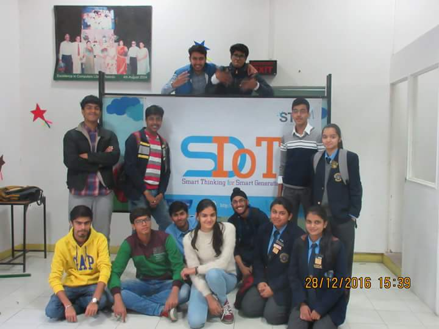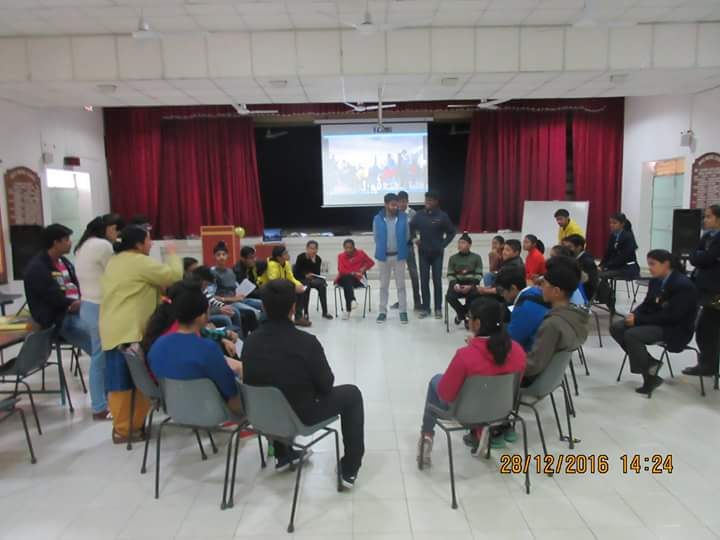

## 2. Galgotia College of Engineering and Technology (Greater Noida)
### Dated: 1st Feb 2017
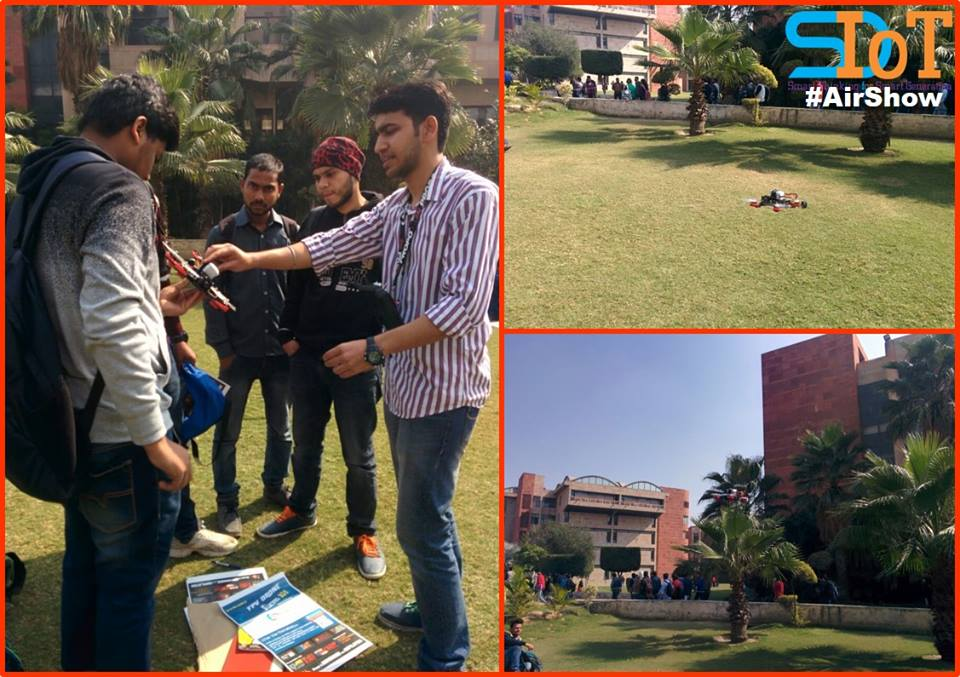

## 3. Delhi Technological University (Delhi)
### Dated: 5th Feb 2017
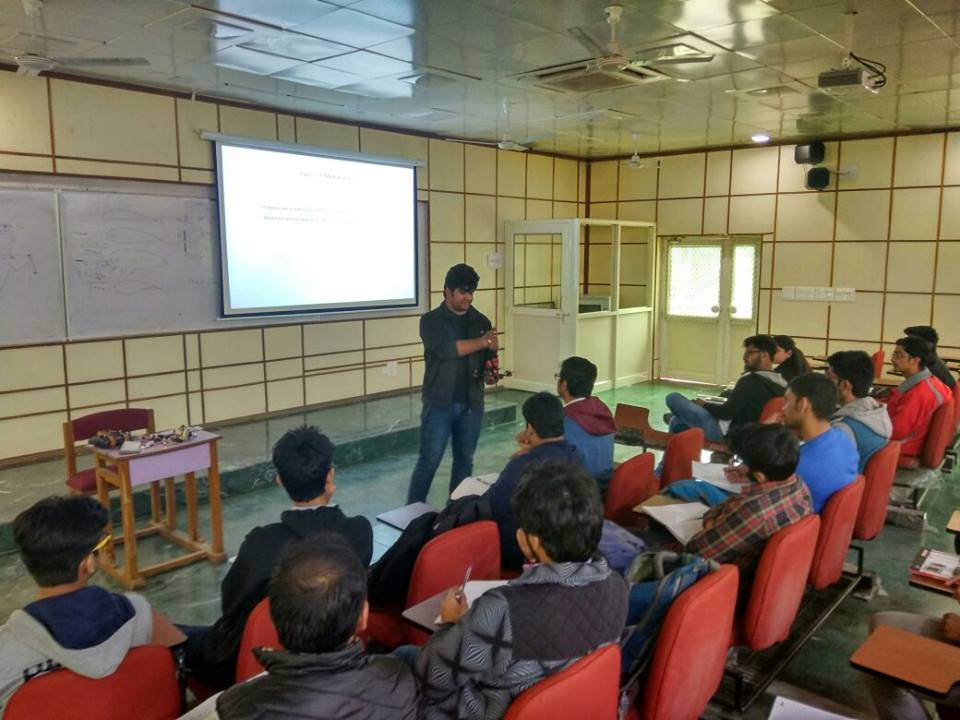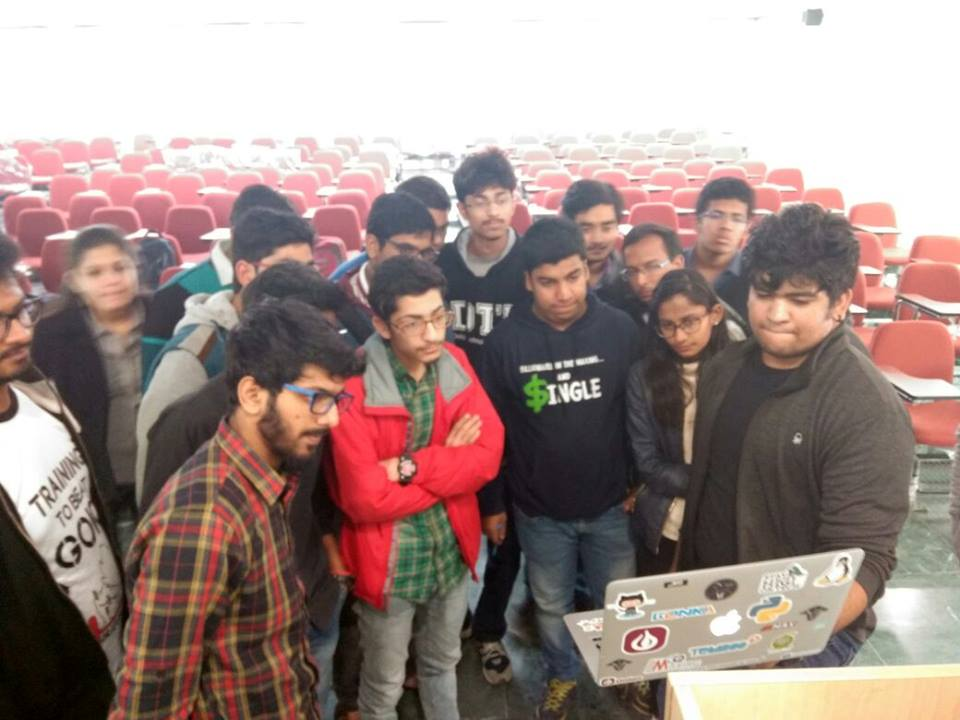

## 4. Sharda University (Greater Noida)
### Dated: 22th April 2017
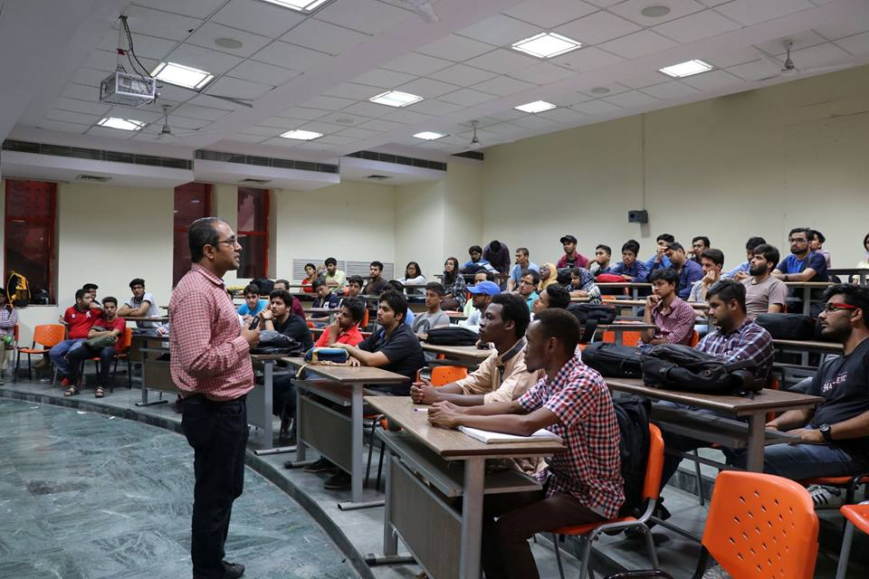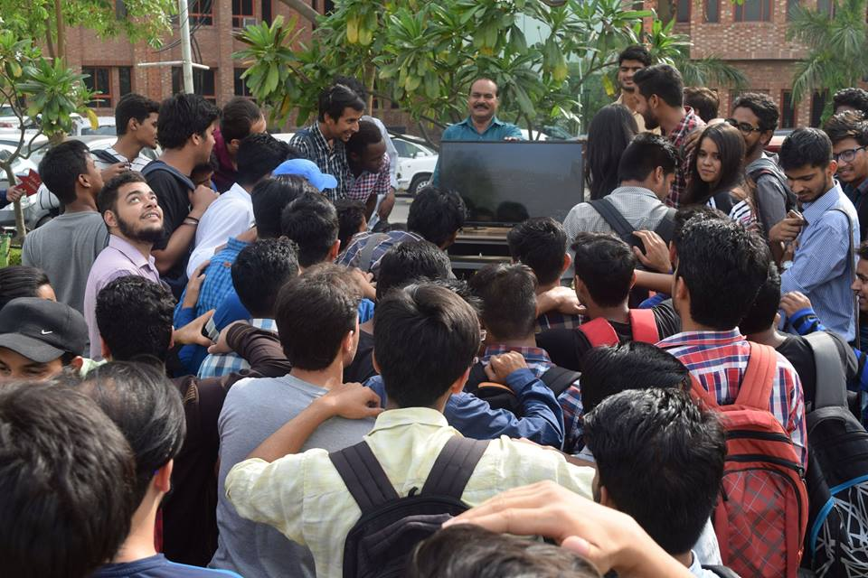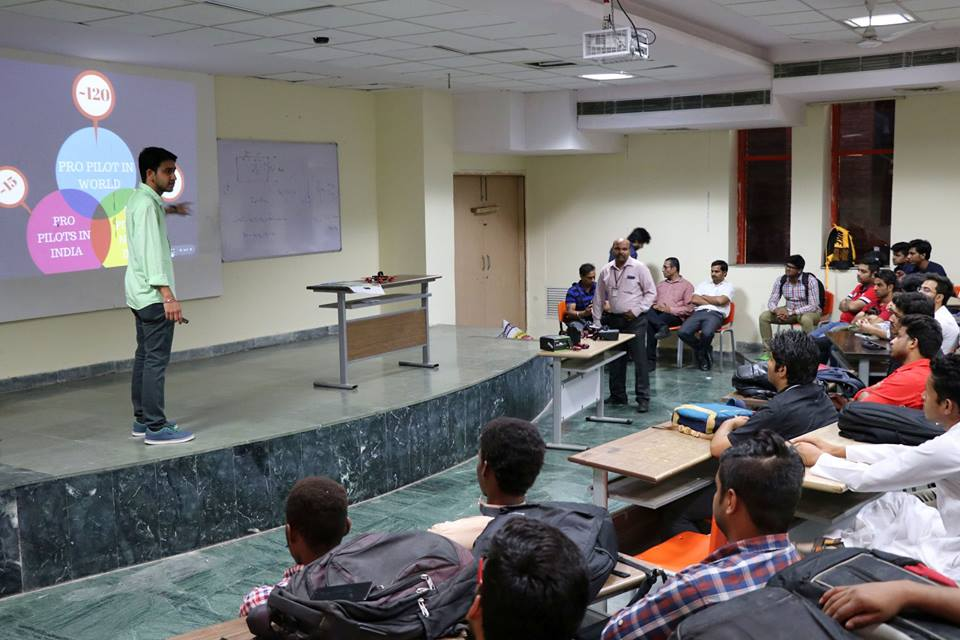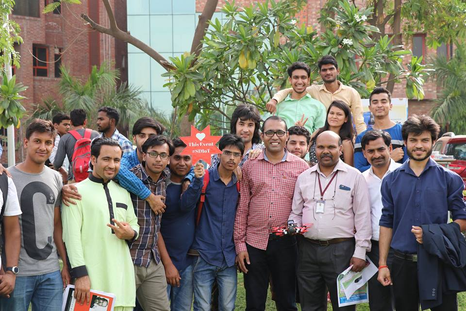

## 5.  Salwan Public School (Gurgaon)
### Dated: 11th Aug 2017
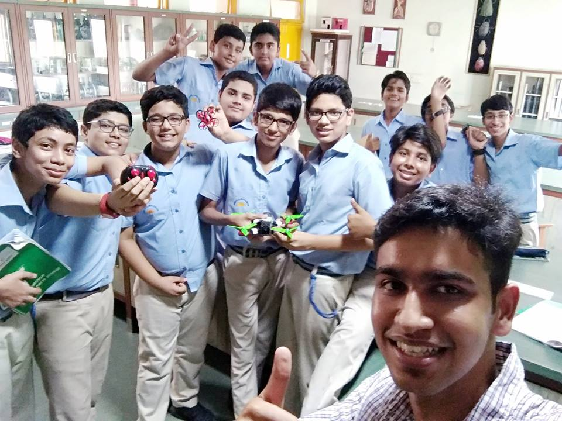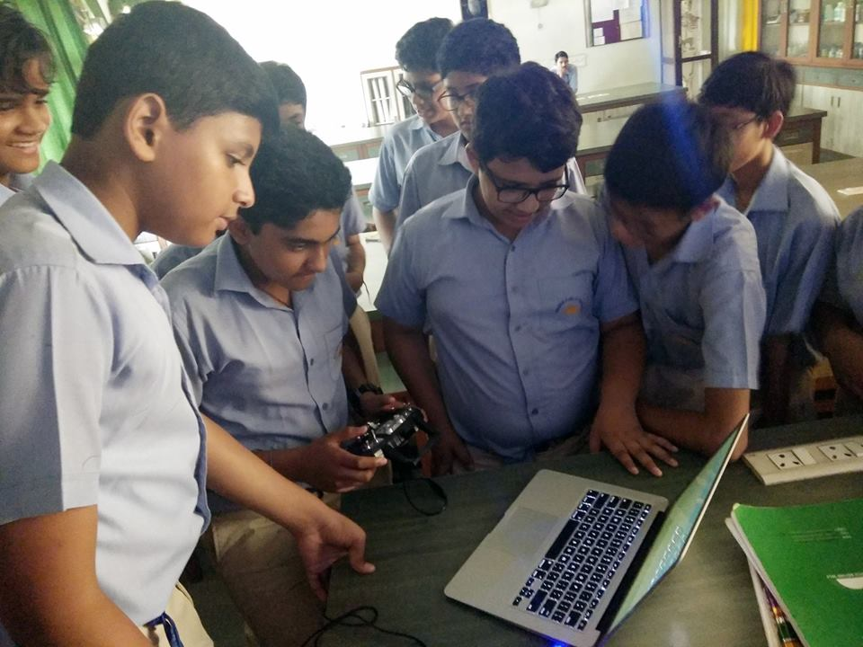
