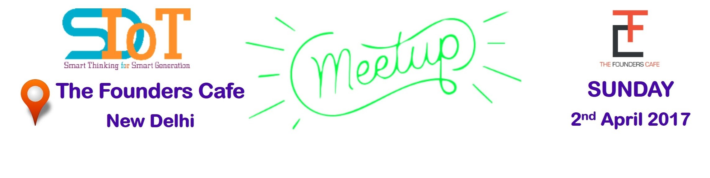
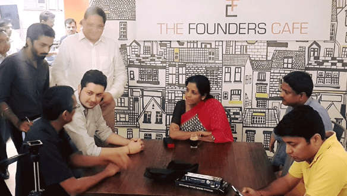

# Meetup - 01

## Venue

### The Founders Cafe
## Time
2:00 pm - 7:00 pm
## Keynotes
### IoT deep dive with Particle Photon and Python Flask
Speaker: Ayan Pahwa
### Cloud Security
Speaker: Sanjeev Pippal
### Exploits and Vulnerabilities: MetaSploit and BadUSB
Speaker: Anirudh Acharya
### Remotely accessing embedded targets and tips on contributing to opensource projects
Speaker: Vijay Rai
### The wearable future
Speaker: Rajdeep Deb
## Simulator Session

## Speaker Session

## Refreshment Session

## Show and Tell

## Project Presentation

