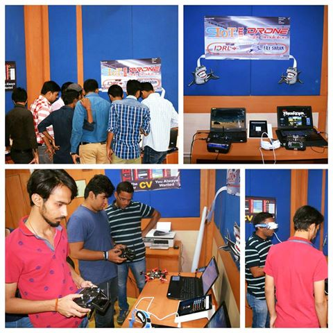

# Meetup-Galgotias College of Engineering & Technology 
## Venue

 
[**Galgotias College of Engineering & Technology**](http://www.galgotiacollege.edu/gcet.asp)
## Time
11:00 AM - 03:00 PM
## Keynote Speakers
**Drones, Maker movement & IoT(Internet Of Things)**

Speaker: Rajdeep Deb

**Hardware Hacking  & Wearable Electronics** 

Speaker: Ayan Pahwa

**Cyber  Vulnerabilities and Security**

Speaker: Sanjeev Pippal

**Artificial Intelligence** 

Speaker: Vijay Rai

## Show & Tell Speakers
+ **Shashank & team-Pydelhi**
+ **Sai & team-Mangalmay**
+ **Rohit & team-Frantic Infotech**

 ## Events
 
 ### DRONE Flight Simulator
 
 
 ### DRONE Air show

 ### Show'n Tell
 ### 3 Minutes Thought

 
