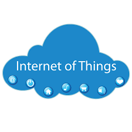

# Getting Started with Internet of Things (IoT)
The internet of things offers an unparalleled opportunity to ignite profound business transformation across every
industry. We are moving towards a new computing paradigm, which will involve trillions of connected
devices. This workshop will leverages and explores the infrastructure, communication, sensor
technologies, networking technologi Work Breakdown Structure (WBS)es, data/storage/analytics and security aspects of IoT. Participants taking this workshop will be introduced to the fundamentals of the IoT paradigm, including hardware
platforms, communication protocols, and the types of services that are enabled for this ecosystem.
## Workshop Details
Workshop Name      : **Internet of Things (IoT) BootCamp**

Workshop Duration  : **Two Day**
## Course Content
The workshop is planned for two days with the following sessions:
+ **Day-1 Session-1 (Theory)**
  + IoT: What & Why
  + Why participate in this bootcamp
  + Different IoT Applicationd
  + Real world IoT deployed examples
  + Interoperability of IoT systems
  + IoT Analytics & Applications
  
+ **Day-1 Session-2 (Hardware)**
  + Hardware platform choices for IOT
  + Comparision of different hardwares
  + Bare Metal VS RTOS VS Operating system enabled SoCs
  + Commuinication support(Ethernet, WiFi, BLE, LoRA)
  + Introduction of ESP8266, NodeMCU WiFi Development board
  + Interfacing different components with Node MCU
  + Sensors, Actuators and Protocols
  + Mini Project: WebServer displaying sensor data to mobile devices
  
+ **Day-1 Session-3 (Software)**
  + IoT: Firmware & OS
  + Pin Mapping and GPIOs
  + Controlling hardware by writing firmware
  + Optimizing service routines for IoT real time applications
  + Importance of deep sleep modes for IoT optimizations especially for battery powered nodes
  + Mini Project: Creating Python Flask based REST enabled webApp with creative frontEnd
  
+ **Day-1 Session-4 (Communication Protocol)**
  + Different options for commuinications
  + Infrastructure independent vs Infrastructure dependent
  + Ethernet vs WiFi
  + Network layer protocols
  + HTTP REST API
  + MQTT protocol for publish subscribe based model
  + Discussion on other protocols: Bluetooth, LoRA, 6LoWPAN, CoAP, LWM2M etc.
  
+ **Day-2 Session-1 (Cloud Integration)**
  + Interfacing with Cloud Server
  + Cloud Dashboard for customized IoT Applications 
  + Bringing together Hardware, Software & Cloud
  + API keys and integrartion
  + Securing your IoT App
  + Mini Project: Deplopying IoT App on public cloud like AWS, AdafruitIO, EclipseIoT
  
+ **Day-2 Session-2 (Projects)**
  + Cloud Data Acquisition and telemetry
  + Remote control of actuators
  + Device Management, Fault tolerence
  + Embedded linux - Need for OS, A case study

+ Major Project
  + Using DHT-11 sensor to measure and remote log temperature and humidity value
  + Creating a dashboard to visualize data
  + Creating Data triggers on temperature values
  + Adding actuators
  + Practical IoT based Home automation for remote management and theft security.
  + Components to be use: DHT-11 sensor, IR sensor, WS8212 LED, Relays.
  
## Learning Outcomes
This workshop will teach you:
+ An understanding of how microprocessors, sensors, and radio hardware are integrated in an embedded
hardware platform.
+ Learn how to make a low footprint battery powered IoT node & communicate between hardware & cloud.
+ Understand the fundamentals of configuring, launching, integrating & maintaining your own IoT solution.
+ Gain knowledge on how interoperability is the key to dealing with the fragmentation of the IoT market.
## Pre-requisites
+ Basic Soldering.
+ C programming language (basic level)
+ Bread boarding (Good to know but not necessary)
## Our Pedagogy
Our proposed workshop is based on experiential learning methodology, which involves a series of highly interactive and intense individual and group based activities. Our relationship with students continues even after the workshop where we offer online and offline technical support to convert their ideas into reality.
## Benefits/Takeaway/Motivation
+ Each Participant will get a participation certificate.
+ SDIoT Toolkit: Participant in a group of 3 will get a toolkit.
+ Each participant will get E-book and future guidance for their projects.
+ Free Membership SDIoT SYK (Share Your Knowledge) Group.
+ 50% Discount on SDIoT P4U Lab Membership.
+ SDIoT P4U Lab t-shirts for top 2 rankers in every college.
## SDIoT P4U Lab
P4U lab is an initiative of SDIoT to inspire Tech-enthusiasts and Entrepreneurs to turn their ideas into new prototypes and products by giving them access to a range of advanced digital manufacturing technology. It began as a common working place of SDIoT members, and became into a collaborative platform of tech-enthusiast from Delhi NCR. You can find more information about P4U Lab on the SDIoT Website.
## Cavent and Contact for Correspondence
The recipient must treat the information shared herewith the document confidential and private. The recipient is not authorized to use or share the information without prior approval from the author of the document. For correspondence, please contact:
                                                     
                                                     The Brain Team
                                                     E: tbt@sdiot.in
                                                M: +91-7982788105/7838525424
                                                      

