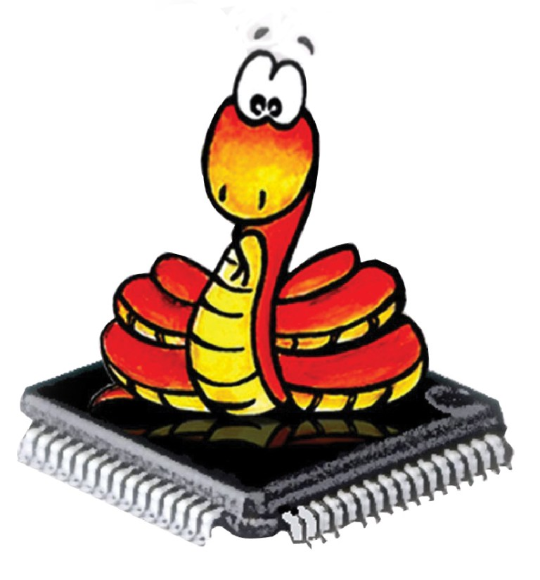

# MicroPython 
MicroPython includes the standard Python interpreter that runs on small embedded development boards. With MicroPython, you can write Python scripts to control hardware. For example, you can make LEDs blink, communicate with a temperature sensor, control motors and publish a sensor reading on the Internet. It is worth noting that the firmware for such embedded devices is generally coded in Assembly, C or C++, but using MicroPython you can achieve almost the same results as with high level Python.

## Workshop Details
Workshop Name : **MicroPython**

Workshop Duration : **One Day**

Workshop Fees : **XXX per student**

## Course Content
+ **Session 1**
  + Basics of MicroPython
  + Pros and cons of MicroPython
  + Boards supported by MicroPython
+ **Session 2**
  + Library stacks supported by MicroPython
  + Implement Web & serial REPL (Read Evaluate Print Loop)
+ **Session 3**
  + Learn tools to make life easy with MicroPython
  + Get to know Networking & Hardware tinkering with MicroPython 
+ **Session 4**
  + Implement your first program on ESP 8266 12E using MicroPython
  + Project Presentation & certificate distribution.
## Pre-Requisites
+ Basic programming knowledge would be good though not actually required.
+ Needed a laptop with Ubuntu installed as virtual machine, dual boot or full OS, or Linux lab.
## Learning Outcomes
+ Knowledge of microPython and how it is different from python.
+ Basics of IoT(Internet of things).
+ About electronics and software associated with a MicroPython.
+ Helpful tips, tricks, and considerations while Uploading and testing your first program on **ESP 8266 12E**.
## Our Pedagogy
Our proposed workshop is based on experiential learning methodology, which involves a series of highly interactive and intense individual and group based activities. Our relationship with students continues even after the workshop where we offer online and offline technical support to convert their ideas into reality.
## Benefits/Takeaway/Motivation
+ Each Participant will get a participation certificate.
+ Hands on session for all participants.
+ Each participant will get E-book and future guidance for their projects.
+ Free Membership SDIoT SYK (Share Your Knowledge) Group: Lifetime Email support.
+ 50% Discount on SDIoT P4U Lab Membership.
+ SDIoT P4U Lab t-shirts for top 2 rankers in every college.
## SDIoT P4U Lab
P4U lab is an initiative of SDIoT to inspire Tech-enthusiasts and Entrepreneurs to turn their ideas into new prototypes and products by giving them access to a range of advanced digital manufacturing technology. It began as a common working place of SDIoT members, and became into a collaborative platform of tech-enthusiast from Delhi NCR. You can find more information about P4U Lab on the SDIoT Website.
## Cavent and Contact for Correspondence
The recipient must treat the information shared herewith the document confidential and private. The recipient is not authorized to use or share the information without prior approval from the author of the document. For correspondence, please contact:

                                                     The Brain Team
                                                     E: tbt@sdiot.in
                                                M: +91-7982788105/7838525424

